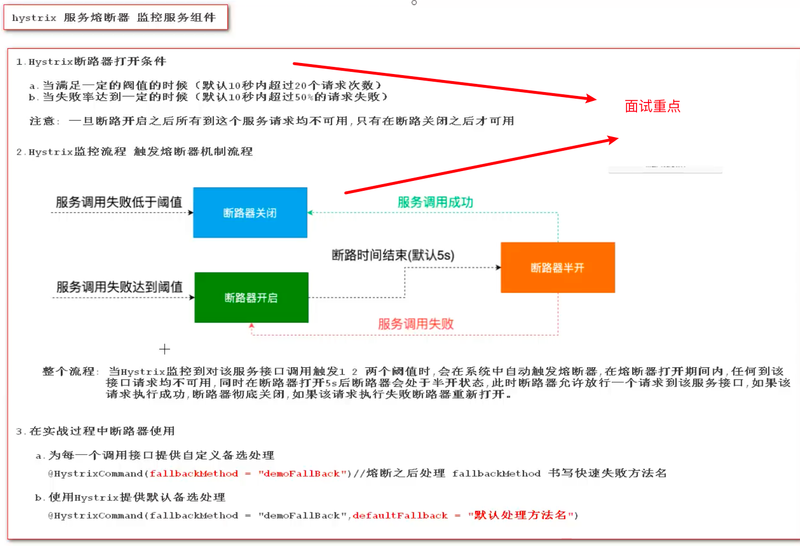
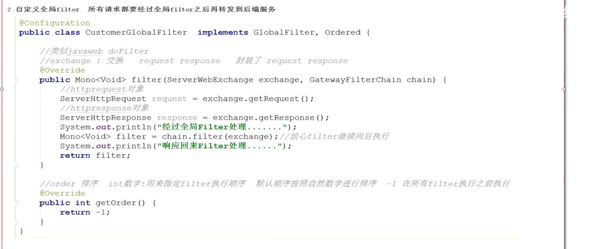

# 什么微服务


# 为什么要有微服务呢（和单体应用架构的区别）


# 微服务架构的演变过程

dubbo：优秀的rpc框架

rpc：远程调用，（传输层），效率远高于应用层的http


# 微服务架构的解决方案

 


# 什么是SpringCloud

快速构建分布式系统的工具 （含有众多微服务的工具集）

服务注册中心  zookeeper

负载均衡  Nginx

服务熔断 

配置管理

网关组件


# 微服务中的重要概念

服务雪崩   服务熔断 服务降级


# SpringCloud 命名和版本选择（重要）


# SpringCloud环境搭建


```properties
<!--父项目只用来维护版本号-->

    <!--继承springboot的父项目-->
    <parent>
        <artifactId>spring-boot-parent</artifactId>
        <groupId>org.springframework.boot</groupId>
        <version>2.2.5.RELEASE</version>
    </parent>

    <!--自定义properties-->
    <properties>
        <!--<maven.compiler.source>8</maven.compiler.source>
        <maven.compiler.target>8</maven.compiler.target>-->
        <spring.cloud-version>Hoxton.SR6</spring.cloud-version>
    </properties>

    <!--维护版本 -->
    <dependencyManagement>
        <dependencies>

            <!--维护springcloud版本 -->
            <dependency>
                <groupId>org.springframework.cloud</groupId>
                <artifactId>spring-cloud-dependencies</artifactId>
                <version>${spring.cloud-version}</version>
                <type>pom</type>
                <scope>import</scope>
           </dependency> 
        </dependencies>

    </dependencyManagement> 
```

# 服务注册中心组件（eureca server（netflix））


 

- 引入依赖

```xml
<!--引入Eureka-server-->
        <dependency>
            <groupId>org.springframework.cloud</groupId>
            <artifactId>spring-cloud-starter-netflix-eureka-server</artifactId>
        </dependency>
```

- 编写配置文件

  ```xml
  # eureka默认端口号  8761
  server.port=8761
  # 指定服务名称 注意：服务名不区分大小写，但推荐大写 不能出现下划线
  spring.application.name=EUREKASERVER
  #eureka server 服务注册中心地址
  eureka.client.service-url.defaultZone=http://localhost:8761/eureka
  
  ```

- 在入口加入注解

  ```java
  @SpringBootApplication
  @EnableEurekaServer
  public class EurekaServerApplication {
      public static void main(String[] args) {
          SpringApplication.run(EurekaServerApplication.class,args);
      }
  }
  ```

### eureka server 细节问题


### eureka server 集群搭建


## eurka client(客户端)

日后的一个个微服务如用户管理 订单信息


### eureka的自我保护机制


 

## consul注册中心


### consul client 服务客户端开发（微服务）


# 微服务通信组件

http   使用http协议传递的是JSON数据   工作在应用层

rpc    传送二进制数据    工作在传输层   dubbo：优秀的rpc框架，使用rpc但要求所有都要用java

springcloud 使用http协议传递数据

rpc效率比http高，但rpc存在一些限制


## 使用RestTemplate实现服务间的调用

RestTemplate  Java提供的http调用方法

```java
// 调用订单服务的 order  服务地址：http://localhost:8085/order  接受返回值string
        RestTemplate restTemplate = new RestTemplate();  // java提供的对象，相当于浏览器
        String orderResult = restTemplate.getForObject("http://localhost:8085/order", String.class);
        log.info("调用订单服务成功:{}",orderResult)
```

### RestTemplate存在的问题

# 

## Ribbon组件（微服务通信组件）

负载均衡组件，通信还是由TestTemplate执行

### Ribbon原理


### 使用Ribbon组件实现负载调用

- 注入 DiscoverClient对象和LoadBalanceClient对象

```java
    @Autowired   // 服务注册于发现客户端对象
    private DiscoveryClient discoveryClient;

    @Autowired  // 负载均衡客户端对象
    private LoadBalancerClient loadBalancerClient;
```


- 使用 Discoverclient 发现服务

```java
List<ServiceInstance> ordersServerInstances = discoveryClient.getInstances("ORDERS");
for (ServiceInstance ordersServerInstance : ordersServerInstances) {
            log.info("服务主机:{},服务端口{},服务地址:{}",
                    ordersServerInstance.getHost(),
                    ordersServerInstance.getPort(),
                    ordersServerInstance.getUri());
        }
```

- 使用 LoadBalances  负载均衡调用

```java
ServiceInstance serviceInstance = loadBalancerClient.choose("ORDERS");  // 默认是轮询策略
log.info("服务主机:{},服务端口{},服务地址:{}",
               serviceInstance.getHost(),
               serviceInstance.getPort(),
               serviceInstance.getUri());
```

-  使用RestTemplate进行调用

```java
RestTemplate restTemplate = new RestTemplate();  // java提供的对象，相当于浏览器
String orderResult = restTemplate.getForObject(serviceInstance.getUri()+"/order", String.class);
```


- 工厂中创建生成RestTemplate方法

```java
@Configuration  // 代表这是一个配置类，相当于spring.xml  工厂：创建对象 bean id class=""
public class BeansConfig {

    // 在工厂中创建restTemplate
    @Bean
    @LoadBalanced  //使用@LoacalBalance注解可以使得对象具有Ribbon负载均衡的特性
    public RestTemplate restTemplate(){
        return new RestTemplate();
    }
}
```

- 直接使用RestTemplate进行负载均衡调用

```java
 // 使用@LoacalBalance注解可以使得对象具有Ribbon负载均衡的特性
   String orderResult =  restTemplate.getForObject("http://ORDERS/order",String.class);

```

### Ribbon原理详解（面试会问）


## 回顾注册中心和Ribbon组件


# openFeign组件

## 什么是Feign组件？

作用于RestTemplate一致，都是一个http客户端

OpenFeignwei:伪HttpClient客户端对象，可以使服务间的通信变得更简单qqq


## 如何使用openFeign

待补充

## 服务间通信之参数传递和响应处理 


## 响应对象处理


## OpenFeign细节

### 配置超时时间


### 配置日志展示


# Hystrix 组件（防雪崩利器）

## Hystrix的使用


## Hystrix细节



## Hystrix和Openfeign结合使用


## Hyatrix DashBoard 的使用


### Hystrix和 dashboard 的状态


# 回顾组件


# Gatway 网关组件 

## 简介


## Gateway 网关的使用


## 网关配置细节

 


 

## 网关路由解析规则


##  网关配置实现负载均衡


## 网关断言（predicate）细节


## 网关filter 细节





# Config 组件  统一配置中心

## confi-server


## config-clientv


#  


## config的刷新

### 手动配置刷新


### 自动配置刷新

# Bus 组件        

 

## configserver连接 mq


## configclient 连接 mq


# webHooks和内网穿透实现自动刷新


# Sringcloud 总结


# ToDo

- 项目Demo对应知识点

- 配置方法模板

- 总结 requestParam requestBody  requestpath   pathParm 注解的用法

-  Integer和int的关系

- dokcer 安装 rabbitmq  https://www.cnblogs.com/yufeng218/p/9452621.html

  

