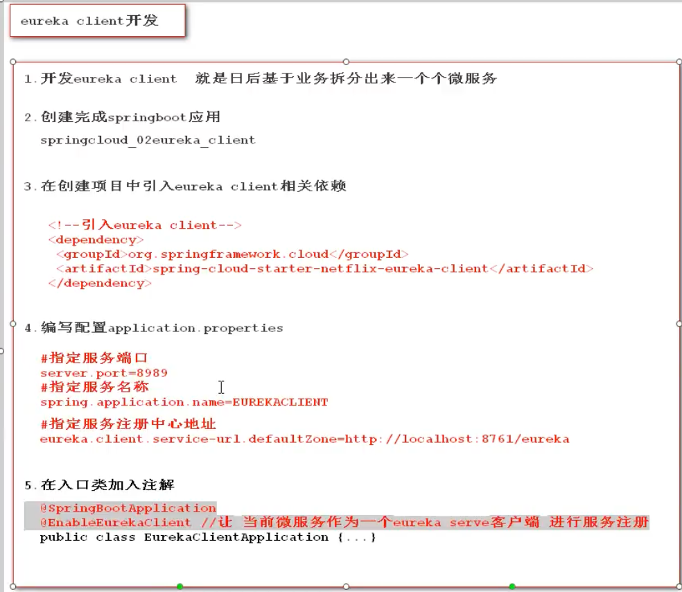

# 什么微服务


# 为什么要有微服务呢（和单体应用架构的区别）


# 微服务架构的演变过程

dubbo：优秀的rpc框架

rpc：远程调用，（传输层），效率远高于应用层的http


# 微服务架构的解决方案

 


# 什么是SpringCloud

快速构建分布式系统的工具 （含有众多微服务的工具集）

服务注册中心  zookeeper

负载均衡  Nginx

服务熔断 

配置管理

网关组件


# SpringCloud 命名和版本选择（重要）


# SpringCloud环境搭建


```properties
<!--父项目只用来维护版本号-->

    <!--继承springboot的父项目-->
    <parent>
        <artifactId>spring-boot-parent</artifactId>
        <groupId>org.springframework.boot</groupId>
        <version>2.2.5.RELEASE</version>
    </parent>

    <!--自定义properties-->
    <properties>
        <!--<maven.compiler.source>8</maven.compiler.source>
        <maven.compiler.target>8</maven.compiler.target>-->
        <spring.cloud-version>Hoxton.SR6</spring.cloud-version>
    </properties>

    <!--维护版本 -->
    <dependencyManagement>
        <dependencies>

            <!--维护springcloud版本 -->
            <dependency>
                <groupId>org.springframework.cloud</groupId>
                <artifactId>spring-cloud-dependencies</artifactId>
                <version>${spring.cloud-version}</version>
                <type>pom</type>
                <scope>import</scope>
           </dependency> 
        </dependencies>

    </dependencyManagement>
```

# 微服务组件 

## 服务注册中心（eureca server（netflix））


 

- 引入依赖

```xml
<!--引入Eureka-server-->
        <dependency>
            <groupId>org.springframework.cloud</groupId>
            <artifactId>spring-cloud-starter-netflix-eureka-server</artifactId>
        </dependency>
```

- 编写配置文件

  ```xml
  # eureka默认端口号  8761
  server.port=8761
  # 指定服务名称 注意：服务名不区分大小写，但推荐大写 不能出现下划线
  spring.application.name=EUREKASERVER
  #eureka server 服务注册中心地址
  eureka.client.service-url.defaultZone=http://localhost:8761/eureka
  
  ```

- 在入口加入注解

  ```java
  @SpringBootApplication
  @EnableEurekaServer
  public class EurekaServerApplication {
      public static void main(String[] args) {
          SpringApplication.run(EurekaServerApplication.class,args);
      }
  }
  ```

### eureka server 细节问题


### eureka server 集群搭建


## eurka client(客户端)

日后的一个个微服务如用户管理 订单信息



### eureka的自我保护机制


 


